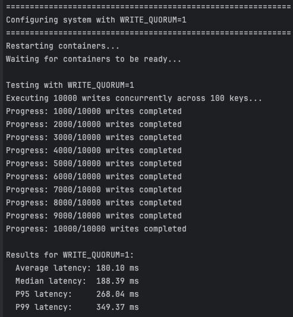
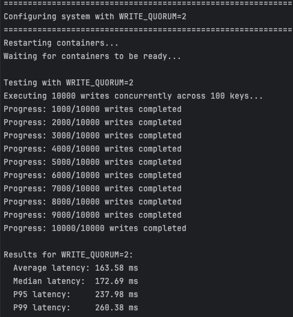
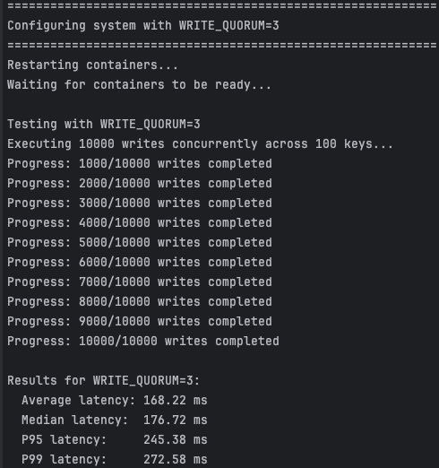
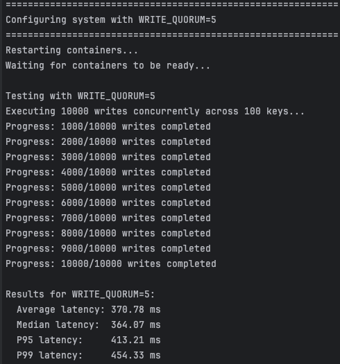
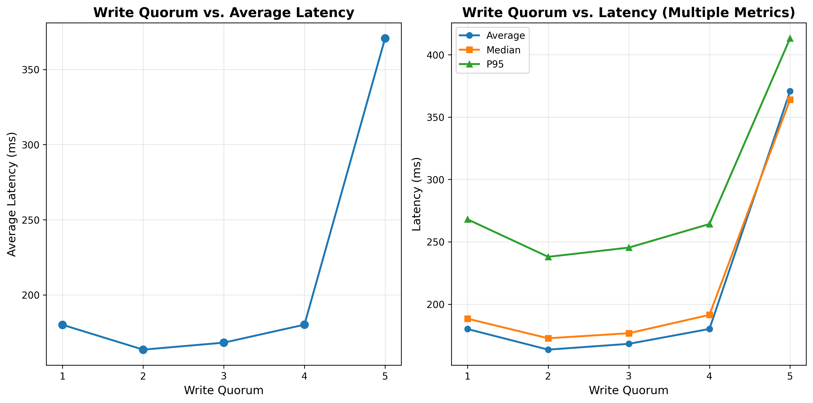

# Lab 4:Single Leader Replication System

## 1. Latency Analysis

### Quorum = 1

Setting WRITE_QUORUM=1 in the Single Leader Replication System resulted in low write latencies by acknowledging writes as soon as the leader processes them, prioritizing performance over strong consistency.

### Quorum = 2

With WRITE_QUORUM=2, your Single Leader Replication System achieves stronger durability while keeping write latencies relatively low, as each write is confirmed only after reaching two replicas.

### Quorum = 3

With WRITE_QUORUM=3, your Single Leader Replication System ensures maximum write durability and consistency by requiring acknowledgment from all replicas, while still maintaining moderate write latencies

### Quorum =4

With WRITE_QUORUM=4, your Single Leader Replication System confirms each write only after all four replicas acknowledge it, providing maximum durability and consistency but at the cost of increased latency.

### Quorum = 5

With WRITE_QUORUM=5, your Single Leader Replication System provides maximum durability by requiring all five replicas to acknowledge each write, which significantly increases latency compared to lower quorum levels.

### Results plot

The chart visualizes how increasing write quorum in the Single Leader Replication System sharply raises latency only at the highest quorum, while lower quorums keep latencies stable and low across all measured metrics.